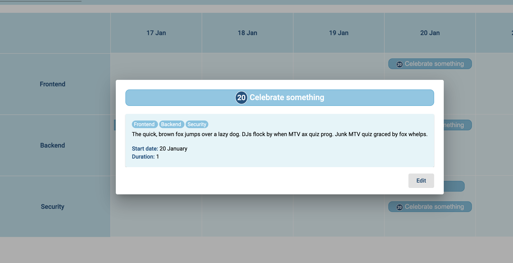
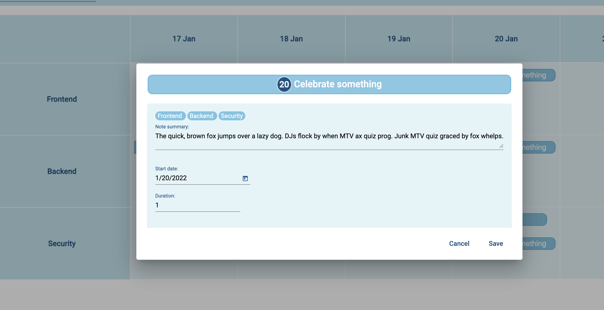

# NotesScheduler

This project to display notes retrieved back from mock server then it can be edited and filtered with labels 

## Developed features 

- It display current week tasks with title and ID then user can use arrows to load previous or next weeks tasks 

   

- Theme can be toggled to dark from left most top bar  icon  

    

- Notes can be filtered by lable 

    

- Note summary displayed as tip while hovering on a note 

    

- Note details should be displayed with title, summary, start date and duration of the note, Also Note labels are on top of the summary.

    

- After clicking on edit button edit mode should be switched so you can change on summary, start date and duration.

    

## Coding notes

- Stack size per day for any label is only 3 notes.
- Changes applied after update affects only front end side so after refresh all changes reverted.
- I have used Angular Material for UI component 
- For dates calculations is done wth the help of `date-fns`
